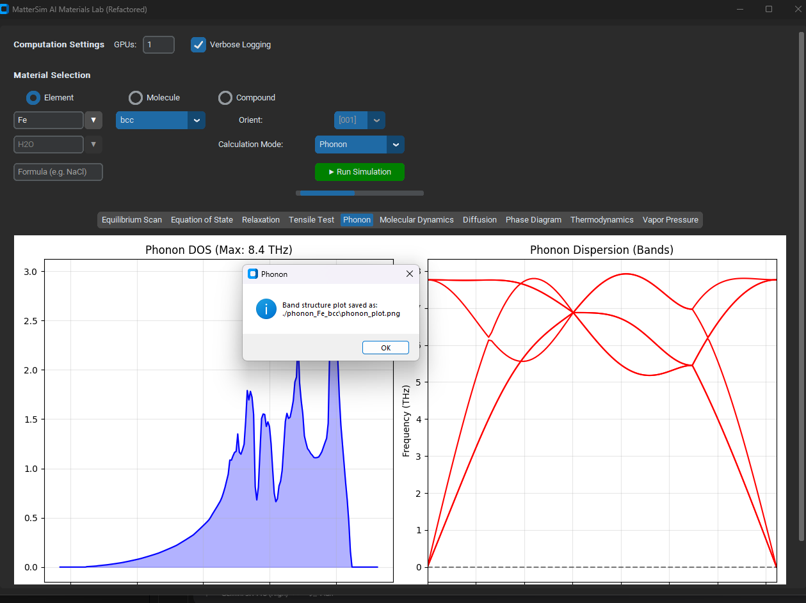
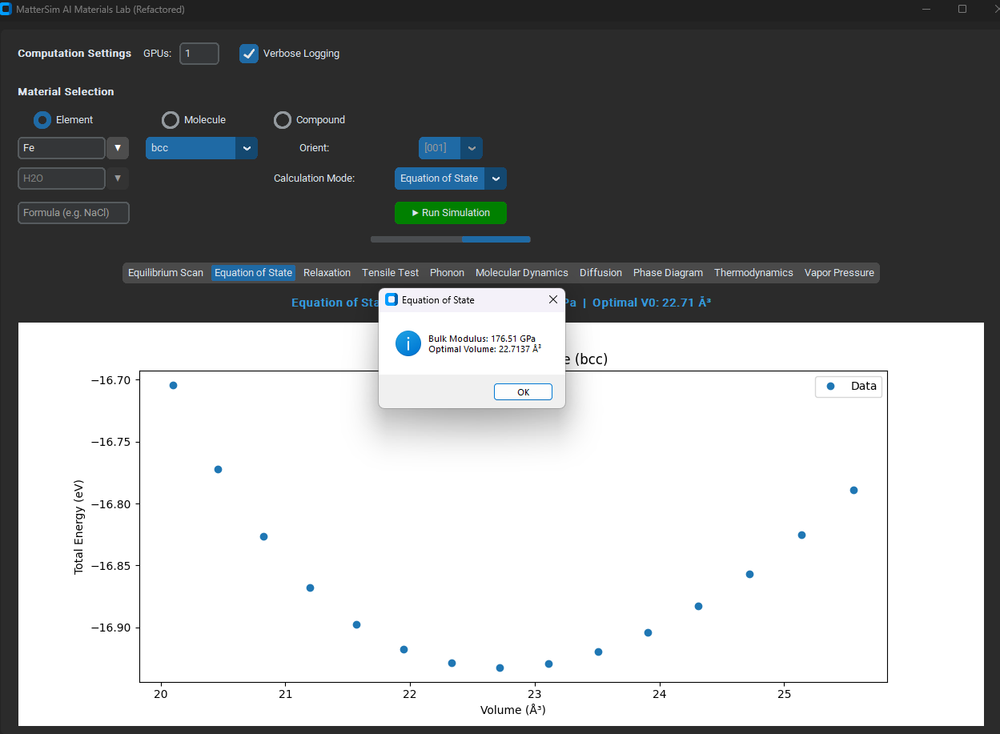
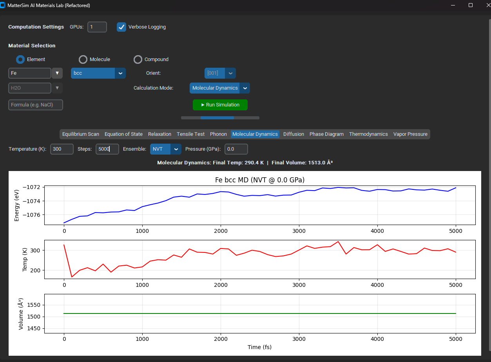

# Material Simulation using MatterSim: Developing an Automated Framework for Advanced Thermodynamic and Vibrational Analysis

Led the technical upgrade and algorithm optimization of an AI-driven materials simulation platform based on Microsoft's MatterSim (Machine Learning Force Field). This project transforms a basic simulation prototype into a highly robust, automated framework capable of analyzing thousands of complex inorganic systems.

## 🚀 Key Technical Contributions & Features

* **Automated Structure Building (ASE Integration):** Replaced manual coordinate inputs by integrating the Atomic Simulation Environment (ASE). The system now automatically queries experimental parameters and generates precise crystal symmetries, expanding the library from a few fixed elements to thousands of materials.
* **Advanced Thermodynamics & Phase Boundaries:** Upgraded static 0K phase predictions to dynamic (T > 0K) phase boundary curves. This was achieved by integrating the Clapeyron equation and vibrational entropy calculations directly derived from phonon spectra.
* **Optimized Phonon Spectroscopy:** Engineered a strict "Relaxation-to-Phonon" pipeline. By implementing 2x2x2 supercell scaling to capture long-range force constants, the framework successfully eliminates imaginary frequencies and flat bands.
* **Isolated Molecule Stability (Vacuum Box):** Resolved critical system crashes during molecular simulations. The engine now automatically encapsulates molecules in a large vacuum box, disables cell relaxation, and extracts discrete vibrational energy levels at the Gamma point.
* **High-Performance Architecture:** Redesigned the Python GUI to be fully multi-threaded using the Matplotlib 'Agg' backend. Implemented "Structural Inheritance" to ensure optimal coordinates are passed safely between modes, preventing data loss and `KeyError` exceptions.

---

## 📸 Visual Results & Screenshots

### Phonon Dispersion & Density of States
*Stable phonon calculations using 2x2x2 supercells, eliminating imaginary frequencies.*


### Equation of State (EOS) Analysis
*Birch-Murnaghan equation of state fitting to determine equilibrium volume and bulk modulus.*


### Isolated Molecule Simulation
*Applying the Vacuum Box Mechanism for stable molecular dynamics without boundary crashes.*


---

## 📂 Project Structure

```text
📦 Material-Simulation-using-MatterSim
 ┣ 📂 images/                  # Screenshots and result plots
 ┃ ┣ 📜 fe_bcc_eos.png
 ┃ ┣ 📜 fe_bcc_mole.png
 ┃ ┗ 📜 fe_bcc_phonon.png
 ┣ 📂 results/                 # Output directories for calculation data
 ┣ 📂 src/                     # Source code directory
 ┃ ┣ 📜 engine.py              # Core simulation pipeline algorithms
 ┃ ┣ 📜 mattersim_phonon.py    # Phonon calculation module
 ┃ ┗ 📜 Lattice constant_Prediction.py # Main GUI application
 ┣ 📜 .gitignore               # Git ignore rules
 ┣ 📜 LICENSE                  # Project license
 ┣ 📜 README.md                # Project documentation
 ┗ 📜 requirements.txt         # Python dependencies
